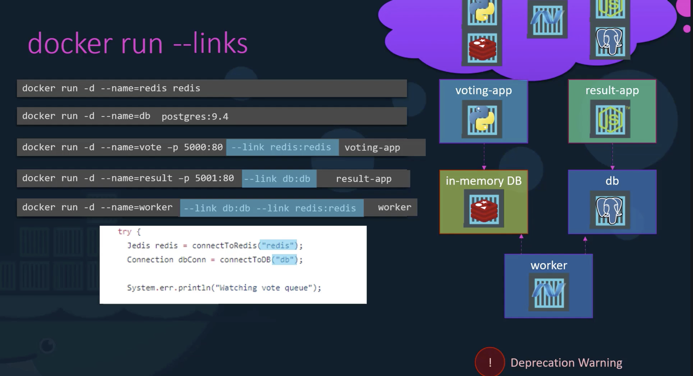
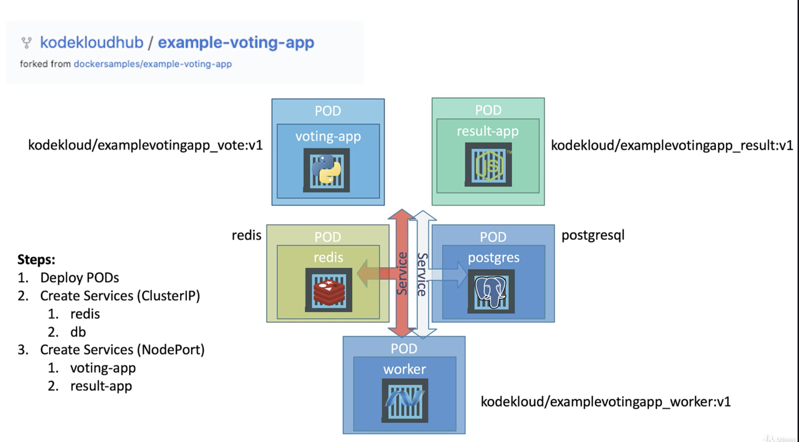

### Deploying an application on Docker

### Deploying an application on kubernetes cluster

In this application, we have    
voting-app --> redis <-- worker --> postgres --> result-app  

Our Goals are  
* Deploy Containers
* Enable connectivity
* Extrenal access for the users.

Steps are  
* Deploy PODs
* We need to know what are the connectivity requirements. We need to be clear on what application requires access to what services.  
Redis database is accessed by both voting-app and worker app. The voting-app saves the vote to the redis database and worker app reads the vote from the redis database.  
Postgres database is accessed by the worker app to update it with the total count of the votes and also it is accessed by the result-app to read the total counts of votes to be displayed.  
voting-app is accessed by the external users i.e., voters and the result-app is also used by the external users to view the results.  
worker app is not being accessed by any one.

A service is only required if the application has some kind of database or process that needs to be exposed or accessed by others.

